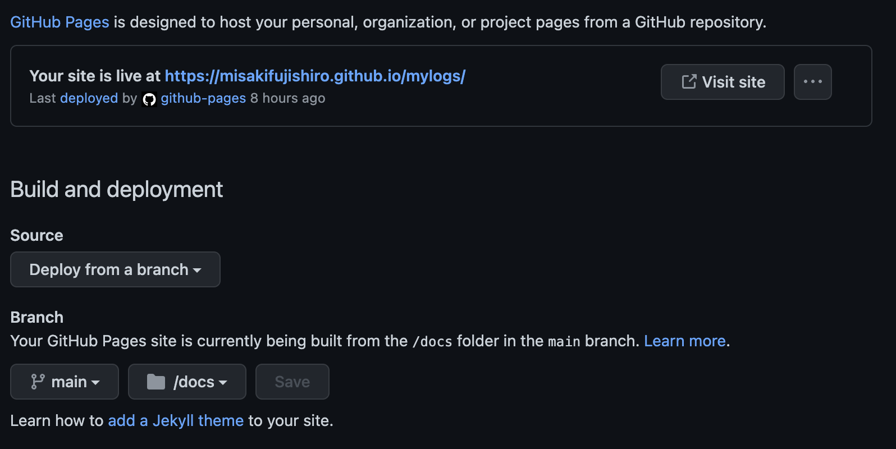

# github Pagesとの連携
## git リポジトリの作成
githubに登録して、リポジトリを作成する。  
git pagesを公開するためには、作成するときにprivateではなくて`public`を設定する。

## Sphinx の設定変更（出力先変更）
1. リポジトリをgit cloneして、sphinxのプロジェクトを作成。
> git clone REPOSITORY_URL

2. githubPagesで公開するために、HTMLファイルの出力先をdocsフォルダに変更する。
   1. docフォルダ作成
   2. filesフォルダを作成（sphinxプロジェクトはこちらに移動）
   3. Makefileを編集
```
SPHINXOPTS    ?=
SPHINXBUILD   ?= sphinx-build
SOURCEDIR     = .
BUILDDIR      = ../docs


# Put it first so that "make" without argument is like "make help".
help:
	@$(SPHINXBUILD) -b help "$(SOURCEDIR)" "$(BUILDDIR)" $(SPHINXOPTS) $(O)

.PHONY: help Makefile

# Catch-all target: route all unknown targets to Sphinx using the new
# "make mode" option.  $(O) is meant as a shortcut for $(SPHINXOPTS).
%: Makefile
	@$(SPHINXBUILD) -b $@ "$(SOURCEDIR)" "$(BUILDDIR)" $(SPHINXOPTS) $(O)
```

3. htmlファイルの出力  
以下を実行して、docフォルダ配下にindex.htmlなどが生成されることを確認
> make html

## github Pagesの設定
リポジトリ/Settiong/Pages  
Sourceで`Deploy from branch`を設定  
Branchで`main/docs`を設定




 ## Tips
files配下に以下をsave.shとして保存しておくと、ファイル確認が簡単になる
> sh save.sh

```
# make clean
make html
cd ../docs/
# git add .
# git status
# git commit -m "shellによるプッシュ"
# git push origin main
open index.html

```