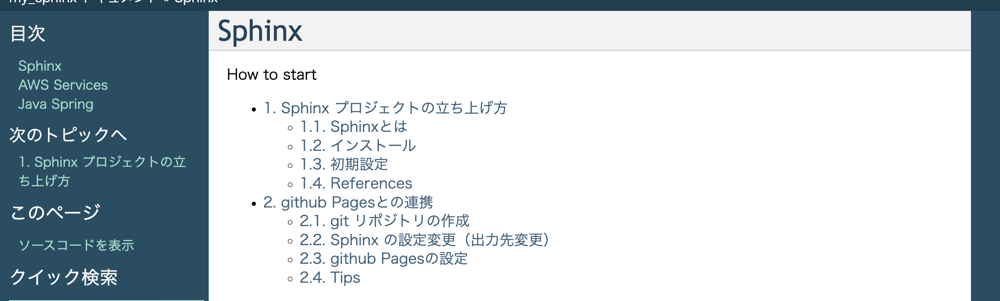

# Sphinx プロジェクトの立ち上げ方
## Sphinxとは
python製のドキュメント生成ツール  
reSTやmarkdownで書かれたファイルをHTMLなどに変換する。  
github Pagesと連携することで、github上でドキュメントを公開できる。
  
## インストールとクイックスタート
python環境がインストールされていることが前提  
以下のコマンドでインストールされているか確認して、されていなければインストールする。
> $ python -V

pipでsphinxをinstall 
> $ pip install sphinx

sphinxのquickstarを実行。対話形式で設定
> $ sphinx-quickstart

Buildしてみる
> $ make html

build/html/index.htmlをブラウザで開くと、quickstartの画面が確認できる。


## mdファイルでドキュメント作成
まず事前準備として、myst-parserをインストール
> pip install --upgrade myst-parser

conf.pyを修正

以下を追加する
```
extensions = [
    'myst_parser'
]

source_suffix = {
    '.rst': 'restructuredtext',
    '.md': 'markdown',
}
```

## テーマ変更
conf.pyの`html_theme`を変更することで、テーマを変えることができる。
以下のサイトが参考になる。

- [テーマパターンと変更方法](https://sphinx-users.jp/cookbook/changetheme/index.html)
- [その他のパターン](https://planset-study-sphinx.readthedocs.io/ja/latest/06.html)


## ファイルの作成
### mdファイル
mdファイルはsource配下に記述していく


### index.rst
index.rstで構成を記載する。
セクション内で指定したDOCFILEがセクションのコンテンツになる。  
ファイルを指定する際は拡張子は不要  
maxdepthで指定された階層までのDOCFILEの階層が目次として出力される。

```
Sphinx
==================

.. toctree::
   :maxdepth: 2
   :caption: How to start
   :numbered:

   Sphinx/quickStart
   Sphinx/githubPages
```




## 実行手順
make htmlを実行することで、更新される

