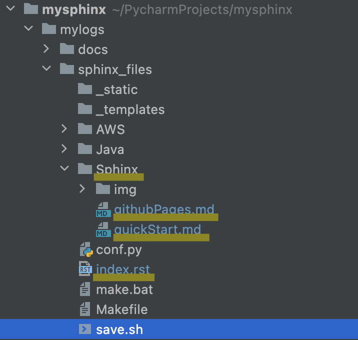

# Sphinx プロジェクトの立ち上げ方
## Sphinxとは
python製のドキュメント生成ツール  
reSTやmarkdownで書かれたファイルをHTMLなどに変換する。  
github Pagesと連携することで、github上でドキュメントを公開できる。
  
## インストール
python環境がインストールされていることが前提  
以下のコマンドでインストールされているか確認して、されていなければインストールする。
> $ python -V

pipでsphinxをinstall 
> $ pip install sphinx

sphinxのquickstarを実行。対話形式で設定
> $ sphinx-quickstart

Buildしてみる
> $ make html

build/html/index.htmlをブラウザで開くと、quickstartの画面が確認できる。


## 初期設定
### 各種ファイルの役割
Makefileはmacでビルドするときに利用。  
make.batはwindowsでビルドするときに利用する。  
conf.pyは生成するドキュメントの設定を記載する。  
index.rstはHTMLファイルの全体構成を記述するファイル  
コンテンツは`.md`や`.rst`で記載

### index.rst
index.rstで全体構成を記載する。
セクション内で指定したDOCFILEがセクションのコンテンツになる。  
ファイルを指定する際は拡張子は不要  
maxdepthで指定された階層までのDOCFILEの階層が目次として出力される。

```
Sphinx
==================

.. toctree::
   :maxdepth: 2
   :caption: How to start
   :numbered:

   Sphinx/quickStart
   Sphinx/githubPages
```




### conf.py
#### 対象のドキュメントファイルにmdを追加する
conf.pyに以下を追加
> source_suffix = ['.rst', '.md']  
> source_parsers = {'.md': 'recommonmark.parser.CommonMarkParser', }  
> extensions = ['recommonmark']


## References
- [Sphinxでドキュメント作成 - github.ioでの公開まで](https://www.kimoton.com/entry/20181009/1539049414)
- [sphinx でドキュメント作成からWeb公開までをやってみた](https://qiita.com/kinpira/items/505bccacb2fba89c0ff0)
- [SphinxとGitHub Pagesで技術ノートを公開しよう！](https://qiita.com/tutuz/items/88a32d94d700b33dc3ea)
