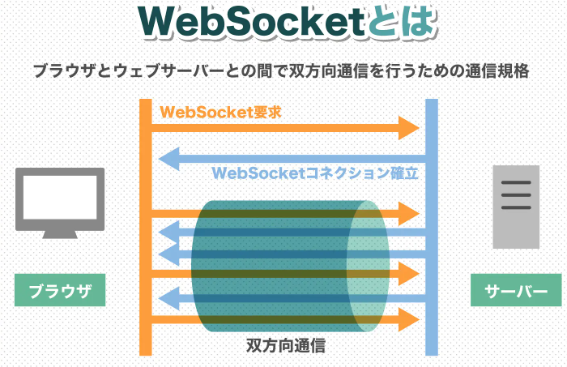

# 開発
## 要件とか設計について
### 要件
色々「要件」というワードの頭にくっついている「非機能要件」とか「API要件」とか。

「システム要件」がメイン

### 要件と設計と仕様について
要件は利用者が欲しいと思っていること

仕様は、外部と関わる部分の「こうなるはず」という完成図

設計や、どうやって作るのかを定義するもの

なので、仕様を満たすために設計をするという形になる。

## 例外について
エラーの分類として、以下のようなパターンが挙げられる。
- ビジネス例外  
    業務的なエラーで、起こることが想定されるエラー（ID/PASS)が間違っているなど
- システム例外  
    システム的なエラーで、起こることはシステム的に望ましくないエラー

## Webサイト
### 静的Webサイト
クライアントのリクエストの内容に関わらず、同じ内容を表示するコンテンツ

HTMLや画像ファイルが静的コンテンツに該当し、静的コンテンツをクライアントに返却するサーバーを`Webサーバー`と呼ぶ。

WebサーバーはOSSのApacheやNginxなどのWebサーバー用のSWをインストールすることで構築することができる。

### 動的Webサイト
クライアントのリクエストの内容や状況に応じて表示する内容を変更できるコンテンツ

このようなジョン点つを提供するサーバーを`アプリケーションサーバー`と呼ぶ。

動的な処理はJavaやPythonなどのプログラミング言語を利用することで実装され、デプロイされたAppを動作させるためには、
プログラミング言語に合わせたSWをAPサーバーにインストール必要があり、JavaであればTomcatやPythonの場合はGunicornなどがある。

## Docker
### Docker File
Dockerで作成するコンテナイメージを管理するためのファイル。
あらかじめ準備されているコンテナイメージにファイルコピーしたり、直接的な編集を行なって、イメージを作成することができる。

### Docker Compose
複数のコンテナで構成されるAppについて、Dockerイメージのビルドやコンテナの起動停止を簡単に行うためのツール

## REST API
本当にざっくり重要ポイント解説すると、以下のルールに従って実装されたAPI
1. ステートレス  
    以前の通信状態に関係なく、毎回条件なら同じ結果を返す
2. 統一インターフェース  
    HTTPのリクエストを受付、JSONやXMLなどで返す

# コーディング
## シングルトン
クラスに対するインスタンスが、たくさんできると管理が面倒なので、そのクラスのインスタンスが必ず一つであることを保証するデザインパターン

JavaにおけるSingletonの定義方法

# 通信
## SSL/TLS
[SSL/TLSサーバ証明書とは](https://www.jipdec.or.jp/library/report/ssl_cert.html)

SSL/TLSは通信の暗号化のプロトコル

## SSL/TLS証明書
[SSL/TLSサーバ証明書とは](https://www.jipdec.or.jp/library/report/ssl_cert.html)

これは実在証明

## Web Socket
Web Scoketとは、ブラウザとウェブサーバーで双方向通信を行うための通信規格。

サーバー側とユーザー側が常にオンライン状態を維持するので双方向を可能とする。

 Load Balancerを経由する場合は、同じサーバーと接続ができるように、スティッキーセッションを利用する必要がある。

[WebSocketとは](https://www.freshvoice.net/knowledge/word/6323/)の解説がわかりやすい

## UDP/TCP
通信相手のコンピューターとデータを送り出すタイミングの調整をしたり、届けられたデータを順番通りに復元したりするなど、通信をおこなう工程を制御しています。

UDPはTCPと比べて、必要最低限の通信量でデータを送受信できることを目的として考案

# DB
## スロークエリ
スロークエリログ (Slow query log) は、MySQL で出力できるログの種類の1つです。 SQL の実行時間が指定した時間よりもかかってしまった SQL を全て出力することができます。 これにより、アプリケーション構築時や本番運用時にパフォーマンスのボトルネックとなっている SQL を発見するのに大いに役に立ちます。

