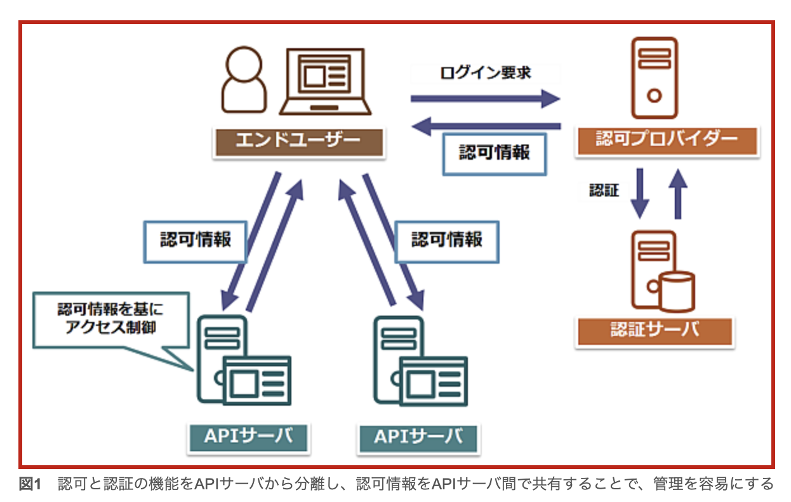
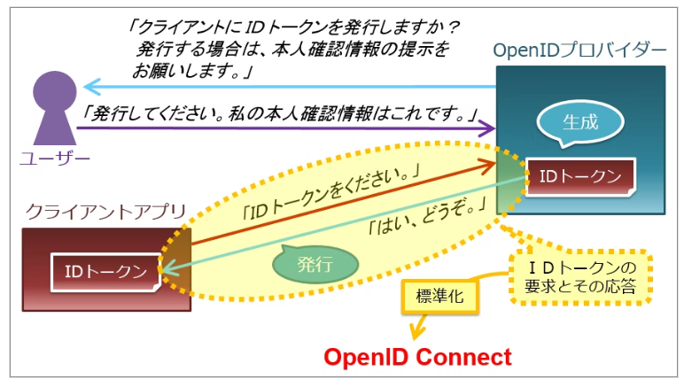
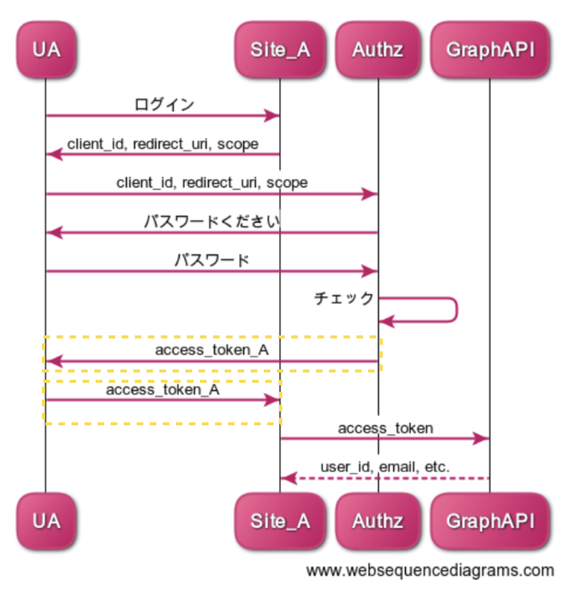
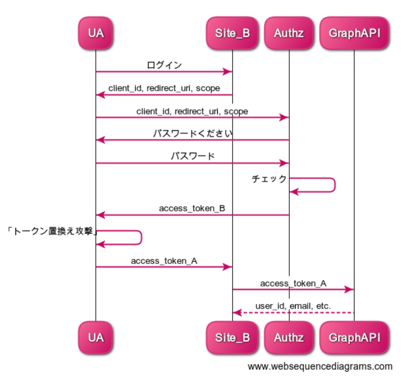
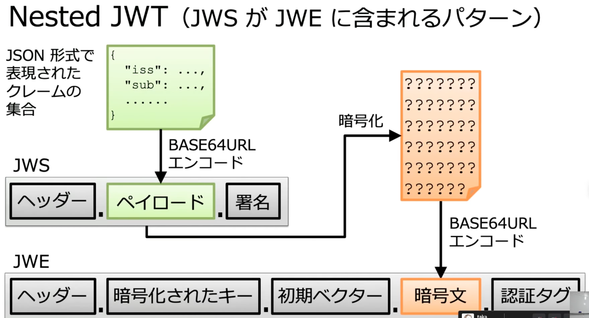

# マイクロサービスにおける認証認可

## 認証認可
### 認証とは
あなたが何者かを問うこと。
なりすましされないように、以下の情報などで本人確認をする。
- What You Are：生体認証とか
- What You Have：トークンとか
- What You　Know：ID/Passwordとか

### 認可とは
リソースにアクセスできる権限（鍵）を渡すこと。  
認可だけでは、誰に鍵を渡すかは意識していない点に注意。  
また、鍵を渡す人（神様)が誰かという点も意識すること

## マイクロサービスにおける認証認可
これまでの認証認可のアーキテクチャでは一つのサービスで認証した情報をセッションで持って、その情報でアクセス制御をしていた。
しかし、マイクロサービスアーキテクチャでは複数のサービスが協調して動作するので、
サービスごとに認証認可をしていると認証情報の保持やアクセス制御のポリシー管理が煩雑になる。
そのためにSSOの仕組みが必要となる。

そこで認証認可をサーバーから切り離して、
ユーザーが認証済みであることを示す「認証結果」やアクセス権限の「認可情報」をリソースサーバー（APIサーバー）と共有することで、
認証情報やアクセス制御のポリシーを一元化し、管理を容易にする必要性がある。

[マイクロサービスにおける認証認可とOAuth・OIDCの仕組み](https://atmarkit.itmedia.co.jp/ait/articles/1708/31/news011.html)がわかりやすい。

また、OAuthやOIDCは仕組みが公開されても、突破することができない。
そのため、汎用的な技術である、案件で採用することは、技術者が容易にキャッチアップすることができ、工数削減に寄与する。

OAuth・OIDCは、スケーラビリティにも優れている。
クライアント側で受領したAccess TokenやID Tokenを検証する際にも、IDプロバイダーが公開している公開鍵を利用することで検証することができ、プロバイダーへの問い合わせが不要

## OAuthとOIDCの関係性
■OAuth  
OAuthは認可のプロトコルである。  
「認可情報」をやりとりするための手順をクライアント・リソースサーバー・認可プロバイダー間で定めた プロトコルが`OAuth`である。

認証の仕組みについて正確な規定はないのだが、一般的に認可処理の一部に認証を含むため、OAuthを認証に流用する「OAuth認証」が流行した。
これは、OAuthは合鍵を利用して認証するようなもので、セキュリティ的に課題を抱えている。

)

■OIDC  
OIDCは認証のプロトコルである。  
OAuthに認証情報をやり取りするID Tokenの仕組みを加えたプロトコルが`Open ID Connct(OIDC)`である。
ID Tokenは`JWT(Json Web Token)`という改ざんに耐性のある技術を利用しており、認証情報をやり取りすることでOAuthの問題を解決した。

)

## OAuth
OAuth2.0とは認可の仕組みであ、クライアントから認可サーバーに対してのアクセストークンの要求とその応答に関する仕様を定めている。  
OAuthのポイントは、
> リソースオーナーが、自分のクレデンシャル（ID/PASSWORD)をクライアントに情報を渡すことなく、リソースサーバーにアクセスすることを許可している

という点である。この点を意識して以下のフローを確認してみてほしい。

### OAuthの登場人物
- リソースオーナー  
人間(神様)リソースサーバーに関する権限を付与することができる人
- ユーザーエージェント（UA）  
リソースオーナーが利用しているブラウザなど
- クライアント  
リソースオーナーから権限をもらって、リソースサーバーにアクセスするアプリなど
- 認可サーバー（Authorization Server）  
リソースオーナーとクライアントの間で権限委譲を仲介する
- リソースサーバー  
リソースオーナーが所有するリソースを管理するシステム

### OAuthの基本的な流れ
基本的な流れは[一番わかりやすいOAuth](https://qiita.com/TakahikoKawasaki/items/e37caf50776e00e733be)がわかりやすいので読んでから以下の説明を確認してほしい。

大雑把なフローとしては以下
1. クライアントは、リソースサーバーのリソースにアクセスしたい！
2. クライアントからリソースサーバーにアクセスすると、認可情報がないから認可サーバーにクライアントをリダイレクト
3. 認可サーバーはリソースオーナに本当に認可情報をクライアントに渡して良いか確認
4. リソースオーナーが承認
5. 認可サーバーからクライアントに対して認可情報を渡す
6. クライアントはリソースサーバーにアクセスする
7. リソースサーバーでは認可情報の検証を行う

OAuth2.0の5番以降の処理として`Authorization Code Grant`と`Implicit Grant`がある。
セキュリティの観点から基本的には`Authorization Code Grant`を利用する。

#### Implicit Grant
ポイントは、Access Tokenがユーザーエージェントやユーザーに返却しているので、Access Token情報が見えてしまっている点。
本来は、Access Tokenは認可サーバーとクライアントだけでやり取りをするべきもの。
UAからAccess Tokenが流出してしまうと、OAuth認証と合わせて大きなセキュリティホールを誘発してしまう。（詳細は後述）

エンドポイントの役割について注目してほしい。
1. クライアントから`認可エンドポイント`にリクエストが届くと承認を行って、`Access Token`をクライアント（裏のUA）に直接返却している
2. `トークンエンドポイント`については利用していない。

#### Authorization Code Grant
ポイントは、認可サーバーとクライアントだけでAccess Tokenをやり取りするために、最初の返却ではクライアント（裏のUA）には認可コードを返している点。
認可コードからAccess Tokenを引き換えるためには、事前に登録されたアプリクライアントであるかのチェックや
Client IDとSecretが必要なため、認可コードが流出してもなりすましは不可能となっている。

エンドポイントの役割について注目してほしい。
1. クライアントから`認可エンドポイント`にリクエストが届くと承認を行って、`認可コード`をクライアント（裏のUA）に返却する。  
2. クライアントから認可エンドポイントで取得した認可コードを`トークンエンドポイント`へ投げることで、`Access Token`をクライアントに返却する。

認可コードを経由することで、Access Tokenのやり取りを認可サーバーとクライアント間で完結させることができる。

### OAuth認証のセキュリティホール
[OAuth認証を利用すると車が通れるほどのセキュリティホールができる](https://www.sakimura.org/2012/02/1487/)日本語訳記事がわかりやすいので読んでから以下の説明を確認してほしい。

`認可`の仕組みであるOAuthを利用して`認証`をしていることで発生する セキュリティホールであり、噛み砕くと
> OAuth認証とは、A君の合鍵（認可情報)を持っているということはA君だよねという本人確認をしている。
> つまり鍵を盗むことができれば、A君になりすましていろいろリソースにアクセスできてしまう。

2つの要因が合わさるとセキュリティホールになる 
- Implicit Grant FlowによりAccess Tokenが流出してしまう
- OAuth認証

#### Implicit Grant FlowによるAccess Tokenの流出
1. ユーザーX は、Implicit Grant Flowに従って認証を行う
2. ユーザーXのAccess Token_XがUAに直接返却される
3. UAやUA上のサイトAが攻撃者だとすると、Access Token_Xが流出してしまう。

#### OAuth認証でのAccess Tokenを利用したなりすまし
1. 攻撃者ZはOAuth認証をしている他のサイトBにおいて、ログインを試みます。
2. 認可サーバーには攻撃者のアカウントで認証して、Access Token_Zを受け取ります
3. リソースサーバーにアクセスする際に、Access Token_Zではなく、Access Token_Xを投げます

サイトBにおいても、認可サーバーにおいても、鍵が誰のものかや鍵を使ったのが誰かについては全く意識していないので、攻撃者ZがXになりすまして認証をすることができました。

## OIDC
OIDCとは認証の仕組みであり、OpenIDプロバイダーに対してのID Tokenの要求とその応答に関する仕様を定めている。  
OAuth2.0を拡張する形でOIDCは設計されている。OAuth2.0ではアクセストークンを発行するための処理フローを定めているが、ID Tokenも発行できるようにした。

### OIDCの基本的な流れ
基本的な流れは[一番わかりやすいOIDC](https://qiita.com/TakahikoKawasaki/items/498ca08bbfcc341691fe)がわかりやすいので読んでから以下の説明を確認してほしい。

上述した通り、OIDCはOAuth2.0を拡張しているため、認可サーバーとOpenID プロバイダー両方の役割を兼ねることが多くなる。

1. クライアントから「OpenIDプロバイダー兼認可サーバー」へID TokenとAccess Tokenをリクエスト
2. リソースオーナーに本人情報の提示とToken発行の承認を依頼
3. 「OpenIDプロバイダー兼認可サーバー」はID TokenとAccess Tokenを生成する
4. クライアントへID TokenとAccess Tokenを発行する

## ID Token
ID Tokenとは、 「いつ」「どこで」「なんのために」発行されたトークンなのかの情報を含んでおり、かつ署名されているため改ざんができない。
これにより、ユーザーが認証されたという事実とそのユーザーの属性情報を捏造されていないことを確認可能な方法で、各所に引き回すことができる。

### ID Tokenの署名について
JWK(Json Web Key)と呼ばれる、暗号化に関する情報のドキュメントを利用して、ID Tokenの署名について検証する。

ID Tokenの署名はサーバー側の秘密鍵で作成され、クライアント側での検証は公開鍵を利用して行う。

### JWTとID Tokenの関係性
#### JWS(Json Web signature)
ヘッダーとペイロードと署名をbase64URLでエンコードしてピリオドで繋いだ形式のドキュメント  
> 【ヘッダー.ペイロード.署名】

各種をbase64URLでエンコードするとそれぞれが、JSON形式になっている。
- ヘッダー  
署名のアルゴリズムを表すパラメータを含む
- ペイロード  
JWSでは、ペイロードはJsonじゃなくても良いがJWTではJsonであることを要求している
- 署名   
バイナリなのでデコードしても中身は不明

#### JWE(Json Web Encryption)
ヘッダーと暗号化されたキーと初期ベクターと暗号文と認証タグをbase64URLでエンコードしてピリオドで繋いだ形式のドキュメント  
> 【ヘッダー.暗号化されたキー.初期ベクター.暗号文.認証タグ】

#### JWT(Json Web Token)
JSON形式で表現されたクレームの集合をJWSもしくはJWEに埋め込んだもの  
クレームには、以下のような情報が含まれており、「いつ」「どこで」「なんのために」発行されたトークンなのかがわかるようになっている
これらをサーバー側で検証することによって、「正しい発行者が」「自サイト向けに」「１時間以内に認証して発行された」IDトークン以外は受け付けないようにできます。
- iss (ISSuer)：トークンの発行者
- aud (AUDience)：トークンの受け手
- exp (EXPiration)：有効期限 

JWS形式の場合
> 【ヘッダー.クレーム.署名】

JWE形式の場合
> 【ヘッダー.暗号化されたキー.初期ベクター.暗号文（クレーム）.認証タグ】

#### ID Token
ID Tokenは、JWTの一種であるが、JWTよりも強い制約がある
- 署名が必須（JWS)
- 暗号化は任意だが、署名してから暗号化（JWSをJWEにする）

> 【ヘッダー.暗号化されたキー.初期ベクター.暗号文（【JWS】）.認証タグ】

ID Tokenのクレームには以下の情報が含まれる
- ユーザーの認証に関するもの
- ユーザーの属性に関するもの

## SAML
OIDC同様に認証の`プロトコル`

### SAML vs OIDC
OIDCはSNS認証などの認証を目的として作成されたため、比較的簡易的なプロトコル

SAMLは非常に複雑な権限管理を行うことができるため、Active Directoryの機能であるActive Directory Federation ServiceやOktaなどのIDPサービスで主に用いられる。

## SSO
SSO(Single Sign On)は一度のログインにより複数のサービスにアクセスするための仕組み。
ログイン回数を減らすだけでなく、ユーザー認証情報の一元管理にも寄与する。

## 参考
- [OAuthの基本に関する動画](https://www.youtube.com/watch?v=PqW948SFSUM&t=2375s)
- [一番わかりやすいシリーズの動画](https://www.youtube.com/watch?v=PKPj_MmLq5E)
- [SAMLの概要とSSOについて](https://baasinfo.net/?p=4418)
- [CognitoとkeycloakをOIDCで連携する手順](https://dev.classmethod.jp/articles/add-keycloak-to-cognito-with-oidc/)

