# キューシステム

## キューの必要性：柔軟性のあるアプリケーション
柔軟性とは
> ビジネス要求に対するサービスの変更のしやすさ

すなわち、以下の観点を満たしている
1. 影響範囲の把握と限定が容易
2. 開発・テストがし易い
3. リリースし易い
4. リリースに失敗した時の影響範囲が小さい

上記1-3の観点を満たし、柔軟性のあるアプリケーションとするために
> モジュール強度を高めたアプリの適切な分割をする  
> モノリスからより小さなコンポーネントへ

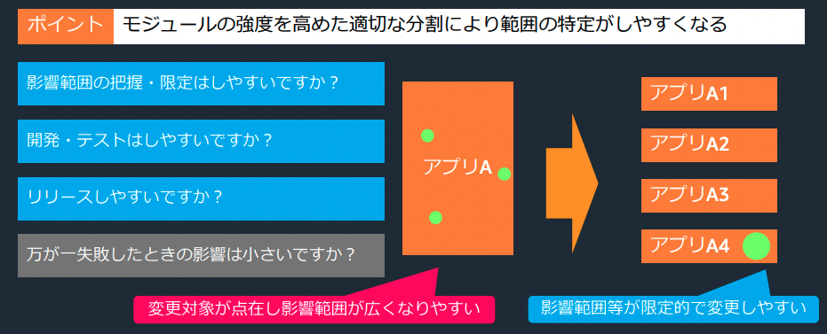

また、4の観点を満たすためには、蜜結合とならないように
> コンポーネント感の結合を弱めることで影響の波及を限定的にする。  
> 蜜結合から疎結合へ

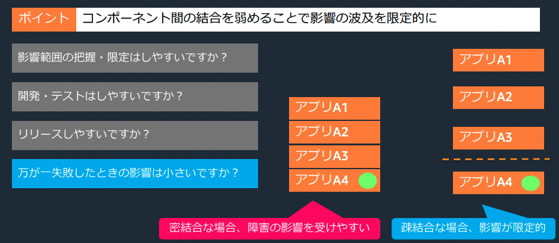

> キューなどのコネクターを利用した疎結合な呼び出しが重要  
> 繋ぐコンポーネントが柔軟性あるアプリケーションを可能にする

## アプリケーションをつなぐ方式
アプリケーションをつなぐ方式は以下の4つの問いにを踏まえて整理する
- 送信するデータの種類は何か  
    ストリーミング/メッセージングの検討
- 呼び出した処理の完了確認は必要か否か  
    同期/非同期の検討
- 処理を行うタイミングは任意か否か  
    push/pull方式の検討
- 処理の依頼先が1ヶ所か複数か  
    P2P publish/subscribe方式の検討

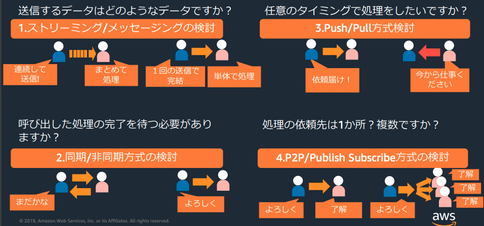

### ストリーミング/メッセージングの検討
■ストリーミング  
一連のデータを送り続け、データの順序性に意味があって、まとめて処理する

■メッセージング  
単発で完結する要求や応答をやり取りする

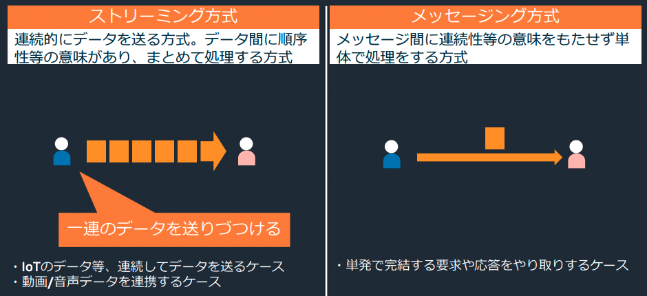

### 同期/非同期の検討
■同期    
ProducerがConsumerの処理の完了を待つ方式

■非同期  
ProducerがConsumerの処理を待たない方式

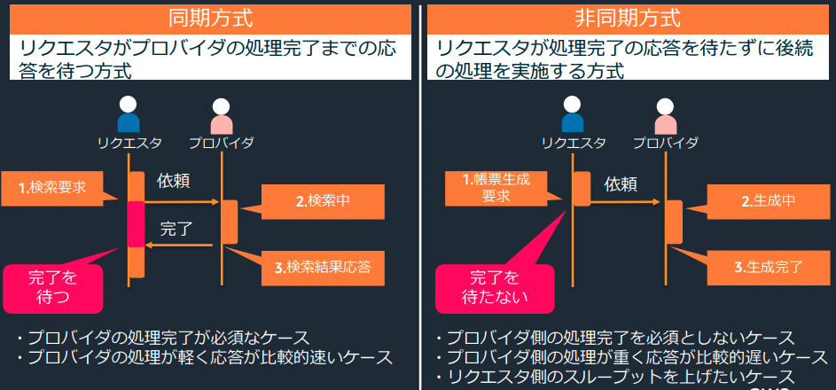

### push/pull方式の検討
■push方式  
Producerがメッセージを送りつける

■Pull方式
Consumerがメッセージを取得しにいく

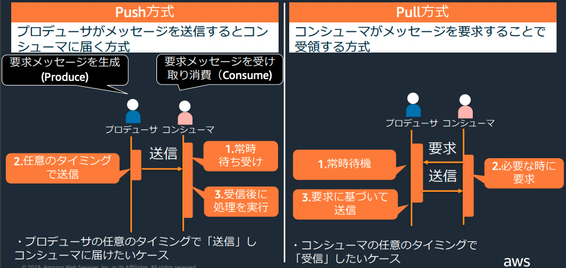

■Connector  
ProducerもConsumerも任意のタイミングで処理するために、Connectorを挟む

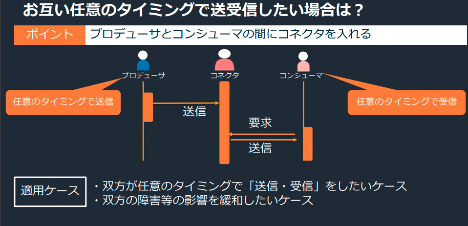

### P2P publish/subscribe方式の検討
■P2P  
ProducerとConsumerが一対一で対応する

■Publish/Subscribe方式  
1つのメッセージを複数のConsumerが受信する方式  
1つのリクエストで複数の処理を並列して実施したい場合に有用

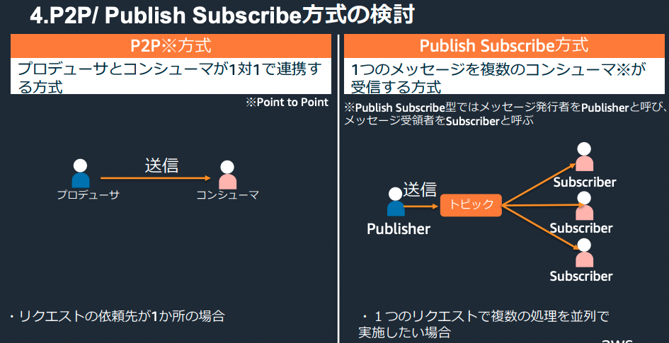

## 関連するAWSサービス
アプリケーションの連携をサポートする主要なAWSマネージドサービスには以下が挙げられる

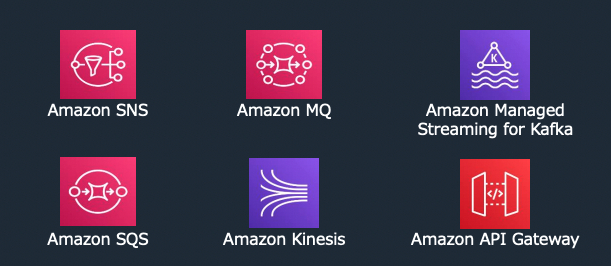

### ストリーミングデータを扱いたい場合
以下の３つのサービスが対象
- Amazon kinesis  
    テキストから動画までのストリーミングデータを扱うことが可能
- Amazon Managed Streaming for Kafka  
    ストリーミングデータを扱うApache Kafkaをマネージドに利用することが可能
- Amazon API Gateway
    WebSockerをサポート

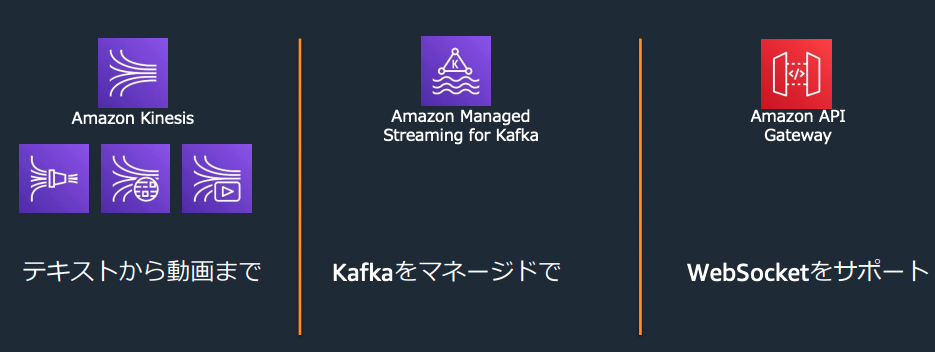

### メッセージングデータを扱いたい場合
以下の３つのサービスが対象
- Amazon SNS
- Amazon SQS
- Amazon MQ

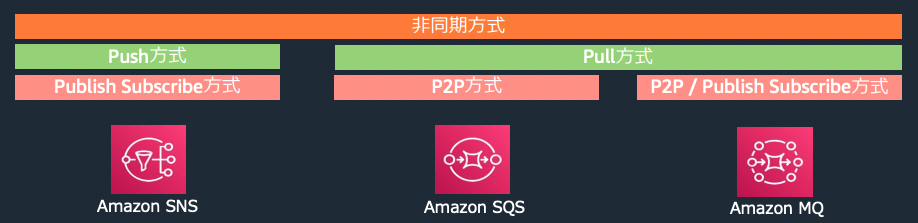